# Reproduction notes

1. `cd datadog-cdk && npm i`
2. `npm run build`
3. `npx cdk deploy`
4. `cd ..`
5. `cd my-sst-app && npm i`
6. `npm sst deploy --stage test`
7. Hit the two endpoints, e.g. `curl https://<your-api-id>.execute-api.eu-west-1.amazonaws.com/prod/` for CDK and `curl https://<your-api-id>.execute-api.eu-west-1.amazonaws.com` for SST

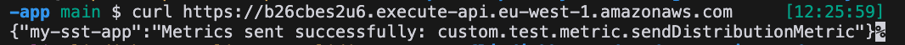

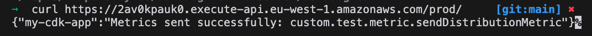

Metrics should be sent to Datadog. Only the cdk app is sending metrics. The SST app is not.

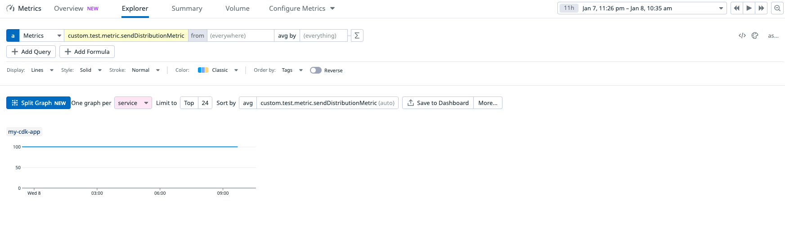

## Notes

We do have a stack in production that works using SST. Here's a representative example of the Lambda configuration:

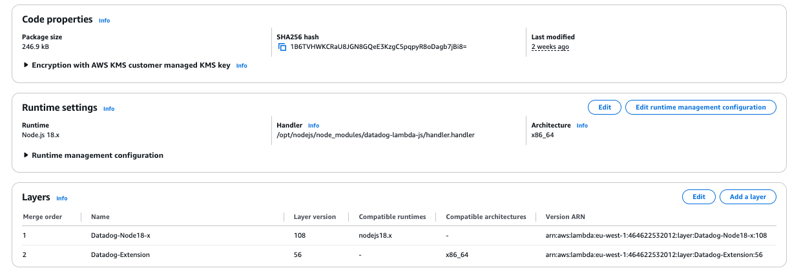
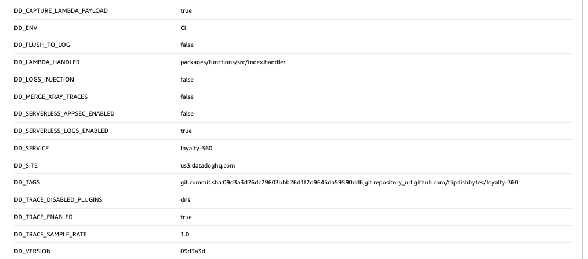

For the SST stack in this repo, the Lambda configuration is the same, but the metrics are not sent to Datadog.

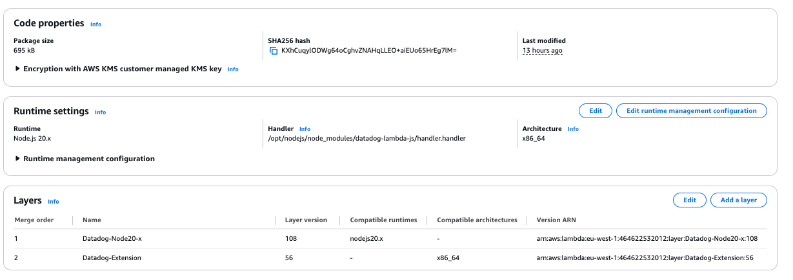

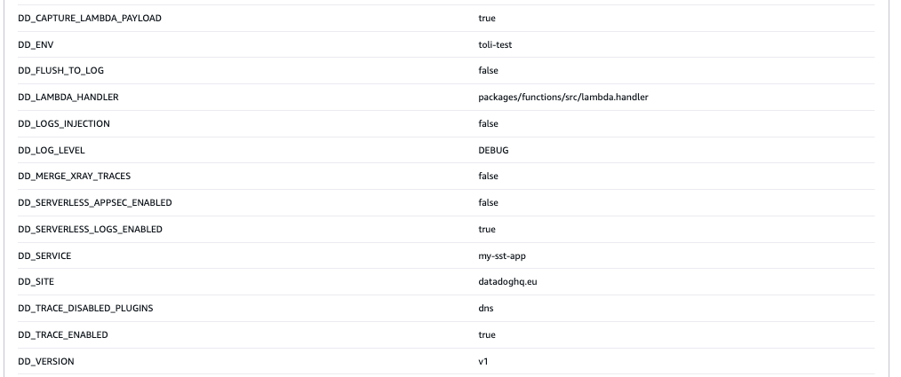

For the CDK stack in this repo, the Lambda configuration looks very similar, but the metrics are sent to Datadog.

The difference is how the Lambda is packaged and deployed.

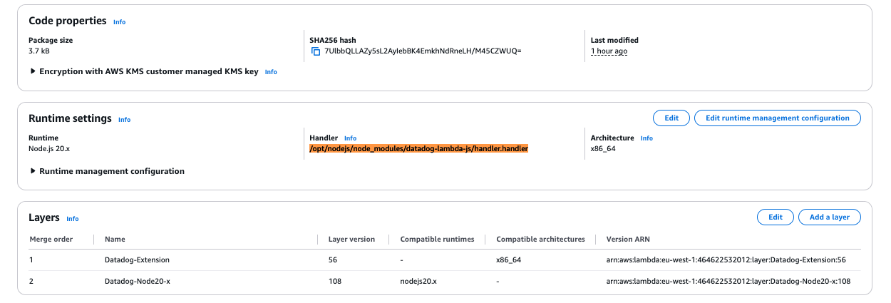


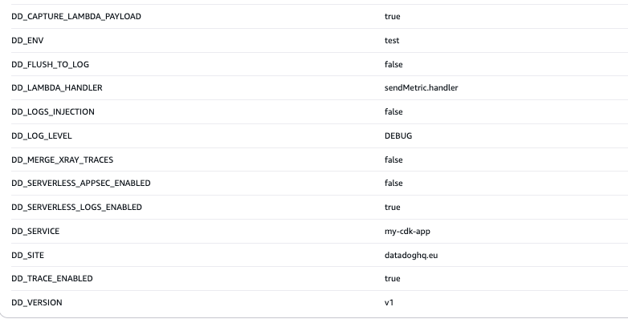

Note how the handler in both cases is set to `/opt/nodejs/node_modules/datadog-lambda-js/handler.handler` and `DD_LAMBDA_HANDLER` is set to `sendMEtric.handler` in the CDK stack, but `DD_LAMBDA_HANDLER` is set to `lambda.handler` in the SST stack. This is correct. WE have also included the `datadog-lambda-js` package in both stacks. According to the documentation this means that we are using the packages rather than the layers? I'm not sure if that's true.

There is documentation [here](https://docs.datadoghq.com/serverless/guide/serverless_tracing_and_bundlers/#aws-cdk--esbuild) that suggesets how to confiugre `esbuild` but this is not implemented in this repo (nor have I tried it).


It turns out that when you set default function props for a stack for `nodejs`, sst replaces the `nodejs` props set in the `sst.config.ts` file.

In the `sst.config.ts` file, we have set 

```js
nodejs: {
        esbuild: {
          external: ["datadog-lambda-js", "dd-trace"],
        },
      }
```  

In the `stacks/MyStack.ts` file, we have set:

```js
nodejs: { sourcemap: true }`.  
```

With this setting, the `esbuild` configuration does not apply. So the `datadog-lambda-js` package is not excluded from the bundle. See the screenshot below.

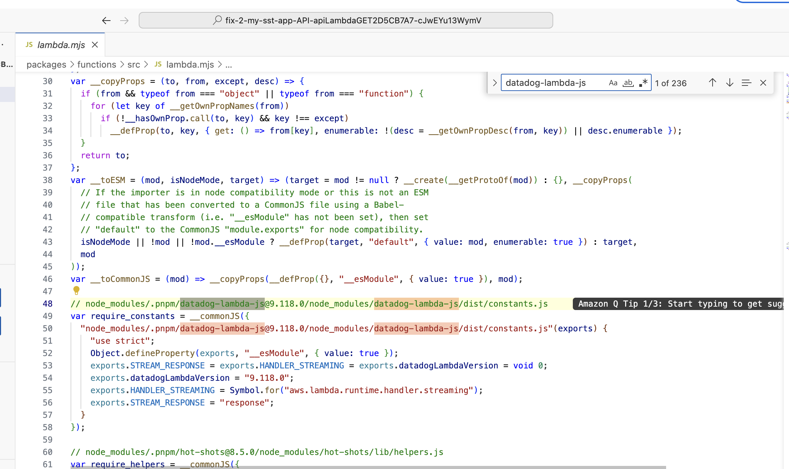

Metrics are not sent to Datadog.

By removing the `nodejs` props from the `sst.config.ts` file, and moving it to the `stacks/MyStack.ts` file:

```js
nodejs: {
      sourcemap: true,
      esbuild: {
        external: ['datadog-lambda-js', 'dd-trace'],
      },
    },
```

The `esbuild` configuration is applied and the `datadog-lambda-js` package is excluded from the bundle. See the screenshot below.

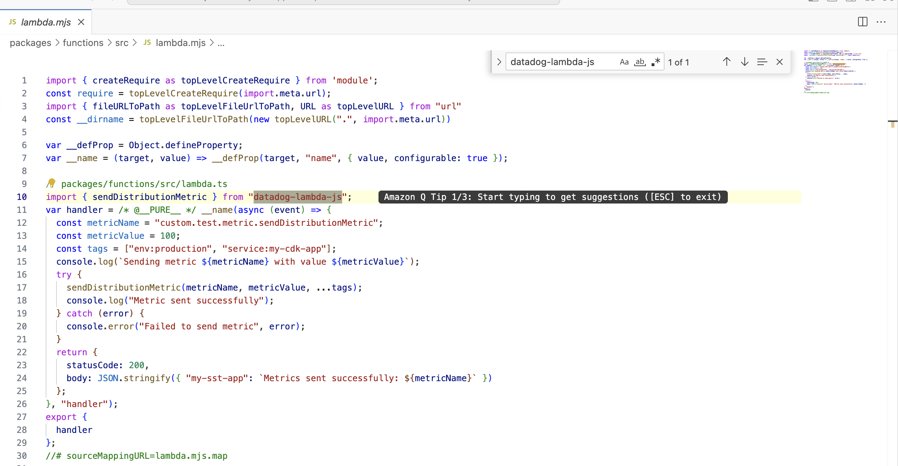

And now we get the metric in Datadog.

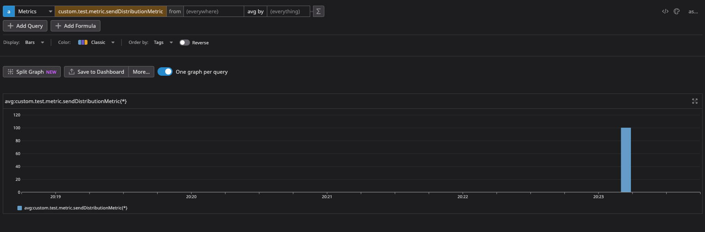


`fix-2-my-sst-app-API-apiLambdaGET2D5CB7A7-cJwEYu13WymV`

The reason why the metrics are now working is because the Lambda function is now using the layer (`nodeLayerVersion`), instead of the `datadog-lambda-js` package. Somehow, if you include both the `datadog-lambda-js` package and the layer, the metrics are not sent to Datadog.

## Updgrading to the latest layers

We still want to try to use the latest layers as they have a significant performance improvement.

Moving from:

```js
const datadogLambda = new DatadogLambda(stack, "datadogLambda", {
    nodeLayerVersion: 108,
    addLayers: true,
    captureLambdaPayload: true,
    extensionLayerVersion: 56,
    site: "datadoghq.eu",
    //apiKeySecret: secretData,
    apiKey: process.env.DD_API_KEY,
    enableDatadogTracing: true,
    enableMergeXrayTraces: false,
    enableDatadogLogs: true,
    injectLogContext: true,
    env,
    service,
    version,
});
```

to:

```js
new DatadogLambda(stack, "datadogLambda", {
          nodeLayerVersion: 118,
          addLayers: true,
          captureLambdaPayload: true,
          extensionLayerVersion: 68,
          site: "datadoghq.eu",
          //apiKeySecret: secretData,
          apiKey: process.env.DD_API_KEY,
          enableDatadogTracing: true,
          enableMergeXrayTraces: false,
          enableDatadogLogs: true,
          injectLogContext: true,
          env,
          service,
          version,
        });
```
